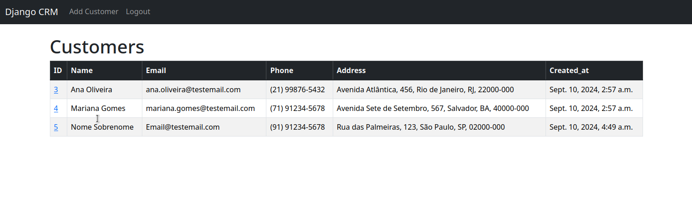
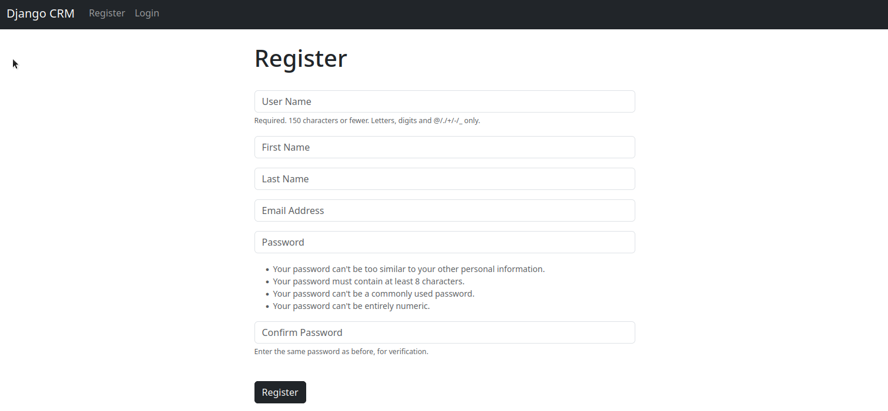
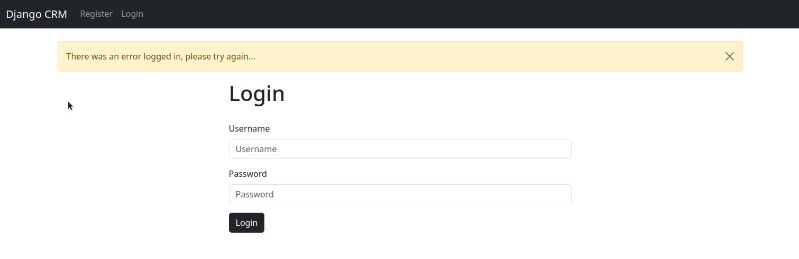
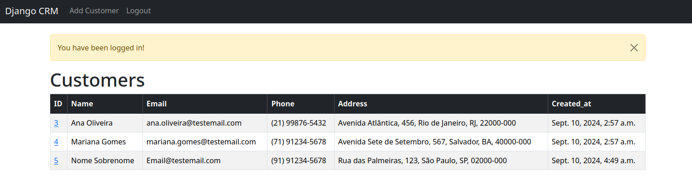
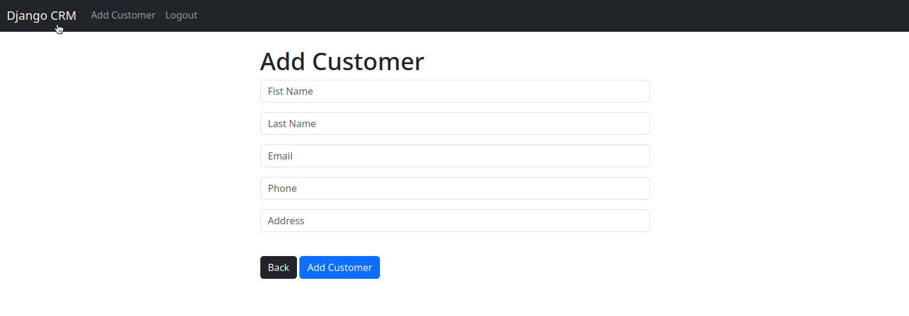
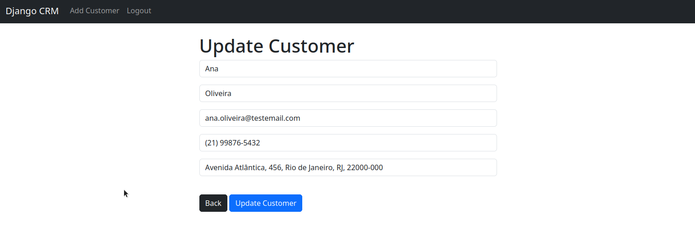
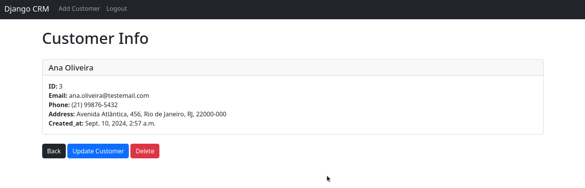

# CRM Project - Django




Este é um projeto básico de CRM (Customer Relationship Management) desenvolvido usando o framework Django. O projeto implementa um sistema de registro e login de usuários, além de um CRUD (Create, Read, Update, Delete) para gerenciar os dados dos clientes.

## Funcionalidades

- Registro de novos usuários
    
- Login de usuários
    
    
- CRUD completo de clientes (Create, Read, Update, Delete)
    - Create
        
    - Read
          
    - Update
        
    - Delete
        
- Banco de dados SQLite3 para armazenar as informações

## Tecnologias Utilizadas

- **Python**: Linguagem principal do projeto
- **Django**: Framework web para o backend
- **SQLite3**: Banco de dados relacional utilizado para persistir os dados
- **HTML/CSS**: Para a interface básica do sistema

## Requisitos

- Python 3.12.5
- Django 5.1.1 (ou versão compatível)
- SQLite3 (já incluído no Django por padrão)

## Como Rodar o Projeto

1. **Clone o repositório:**
   
   ```bash
   git clone https://github.com/byakkott/crm-django.git
   cd dcrm
   ```

2. **Crie e ative um ambiente virtual:**
   
   ```bash
   python -m venv .venv
   source .venv/bin/activate  # No Windows use .venv\Scripts\activate
   ```

3. **Instale as dependências do projeto:**
   
   ```bash
   pip install -r requirements.txt
   ```

4. **Realize as migrações do banco de dados:**
   
   ```bash
   python manage.py migrate
   ```

5. **Crie um superusuário (opcional):**
   
   ```bash
   python manage.py createsuperuser
   ```

6. **Inicie o servidor de desenvolvimento:**
   
   ```bash
   python manage.py runserver
   ```

7. **Registre seu usuário para fazer login:**

    
   
9. **Faça login:**

    
    